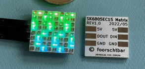
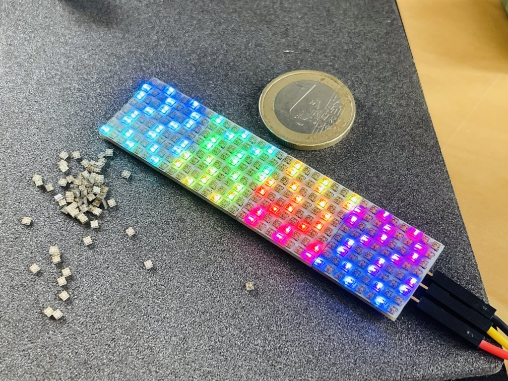
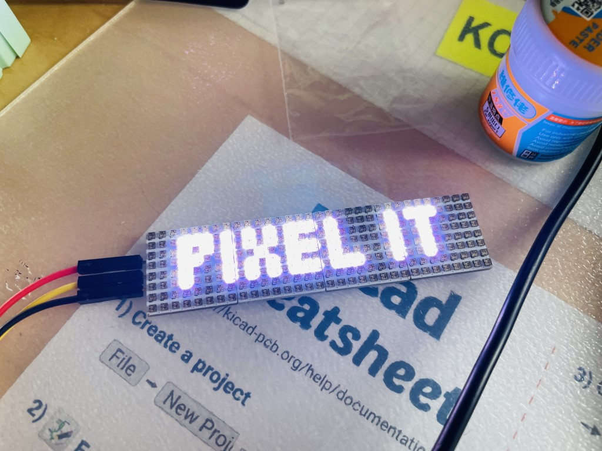

#  MicroMatrix

A very tiny 8x8 Pixel LED Matrix (20x20mm) with 64x SK6805-EC15 (1.5x1.5mm) LEDs. With four panels in a chain (8x32 Pixel) perfect for the [PixelIt](https://github.com/o0shojo0o/PixelIt) project.







## Layout

```
00 01 02 03 04 05 06 07

15 14 13 12 11 10 09 08

16 17 18 19 20 21 22 23

31 30 29 28 27 26 25 24

32 33 34 35 36 37 38 39

47 46 45 44 43 42 41 40

48 49 50 51 52 53 54 55

63 62 61 60 59 58 57 56
```
## BOM

See [iBOM](./fab/ibom.html)
## Production and Assembly

1. Open KiCad Command Prompt
2. Panelize PCB with [KiKit](https://github.com/yaqwsx/KiKit)

    `kikit panelize -p kikit_panelize.json MicroMatrix.kicad_pcb MicroMatrix_Panel.kicad_pcb`

3. Build fabrication files (Gerber, BOM, POS)

    `kikit fab jlcpcb --no-drc --assembly --field "LCSC Part Number" --schematic MicroMatrix.kicad_sch MicroMatrix_Panel.kicad_pcb fab`


## Other

Inspired by [gumslone/led-matrix](https://oshwlab.com/gumslone/led-matrix).
